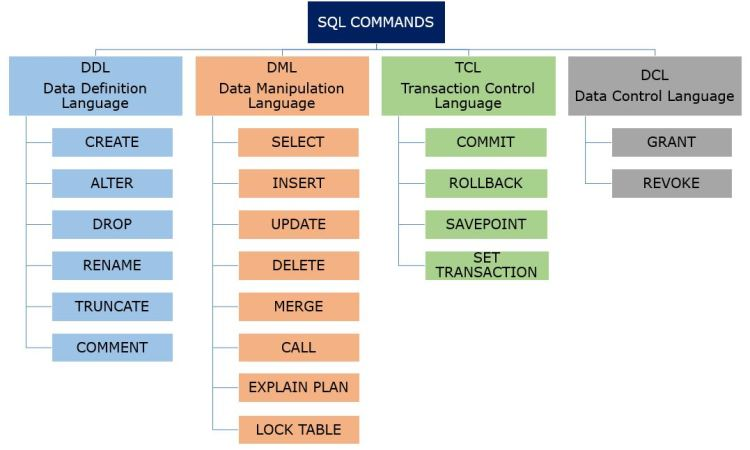

  

&#xa0;

<h1 align="center">Sql Essentials</h1>

  
  
  
  
  
  
  

<!-- Status -->

<h4 align="center">
	🚧  Sql Essentials 🚀 Under construction...  🚧
</h4>

  <a href="#dart-about">About</a> &#xa0; | &#xa0;
  <a href="#useful-tools">Useful tools</a> &#xa0; | &#xa0;
  <a href="#sql-command-types">SQL Command Types</a> &#xa0; | &#xa0;
  <a href="#memo-license">License</a> &#xa0; | &#xa0;
  <a href="https://github.com/lucasluizss" target="_blank">Author</a>

 

## :dart: About

Sql samples and useful notations.

## Useful tools

- [VSCode Sqlite](https://marketplace.visualstudio.com/items?itemName=alexcvzz.vscode-sqlite)
  - VSCode extension to explore and query SQLite databases.
- [DBeaver Community](https://dbeaver.io/)
  - Free multi-platform database tool for developers, database administrators, analysts and all people who need to work with databases. Supports all popular databases: MySQL, PostgreSQL, SQLite, Oracle, DB2, SQL Server, Sybase, MS Access, Teradata, Firebird, Apache Hive, Phoenix, Presto, etc.

## SQL Command Types

	

## :memo: License

This project is under license from MIT. For more details, see the [LICENSE](LICENSE.md) file.

	Made with ♥ by Lucas Silva

&#xa0;

<a href="#top">Back to top</a>
